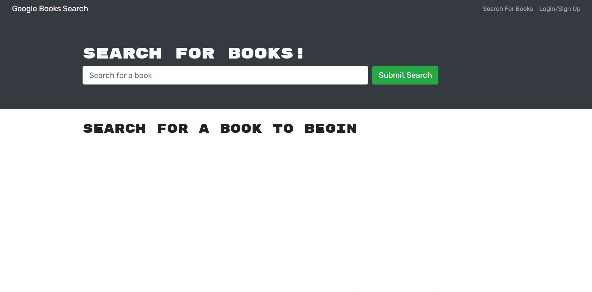
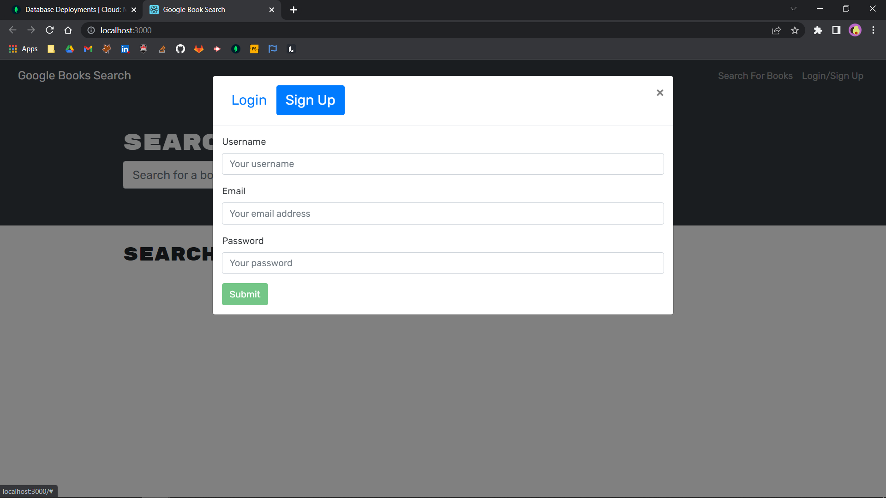
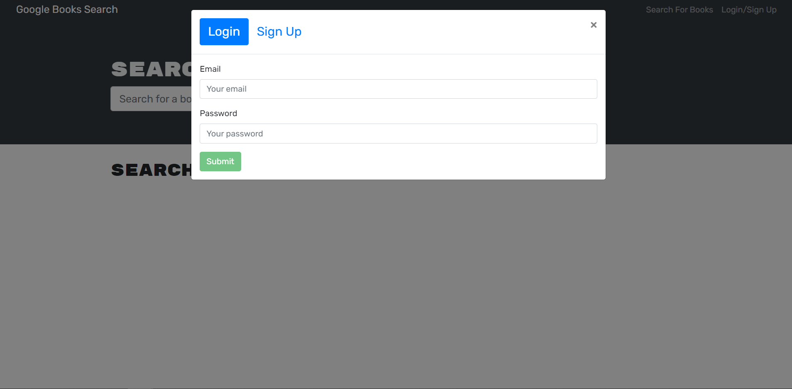
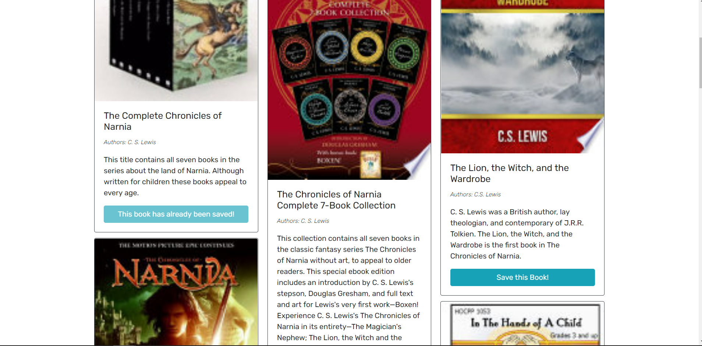
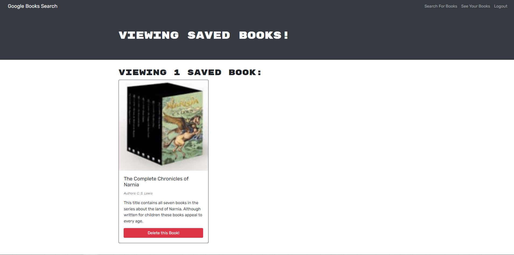

  
  
# Book-Search-Engine

## Description

Search for books with this book search engine app powered by google books api. Keep track of your favourite books and search for new and exciting reads.

**Table of Contents**

  * [Deployed Application](#website)
  * [Usage](#usage)
  * [Contributing](#contributing)
  * [License](#license)
  * [References](#references)
  * [Questions](#questions)

## Website

[Google Book Search](https://damp-mesa-98798.herokuapp.com/)

## Usage

  - visit the websit url, you may search for books from here but to create booklists you need to sign up/ login
    
    

 - sign up

    

 - login

    

 - add books to your book list

    

 - remove books from your book list
 
    

## Contributing

All contributions are subject to review.

## License
  
This application is licensed under [ISC](https://opensource.org/licenses/ISC).

## References

Coding Bootcamp - Module 21: Deep Thoughts

## Questions

Github: [RochelleYounger](https://github.com/RochelleYounger)

Contact Me: [regnuoy321@gmail.com](mailto:regnuoy321@gmail.com)

---
© 2022 RochelleYounger
